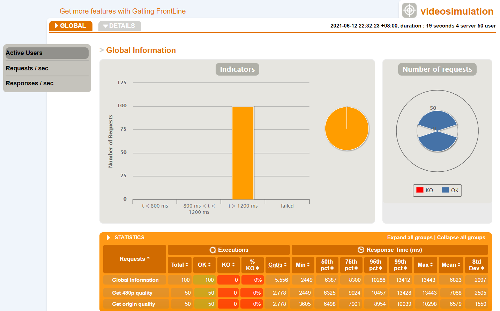

# 视频网站

基于Spring Kafka Python Handbrake实现的视频上传、储存编码与播放

演示视频：https://www.bilibili.com/video/BV1hv411p7BN 或目录下 `演示.mp4`


## 目录结构

`client/`  基于PyQt的简陋客户端测试，通过HTTP-PUT接口上传视频

`encoder/` 基于Python, Kafka和Handbrake的视频编码系统，作为消息队列的消费者，接收并执行编码任务

`gatling/` Gatling测试文件以及测试结果文件

`haproxy/` Haproxy配置文件

`site/` 基于Spring的视频上传下载服务


## 运行

> 由于Windows10家庭版未支持NFS，故没有使用NFS，直接将视频保存在本地

**运行方式：**宿主机运行`kafka`和`encoder`服务，docker运行若干视频服务，将数据目录挂载到docker中

1. kafka (需先启动zookeeper)
   
   ```
   config/server.properties:
      [+] advertised.listeners=PLAINTEXT://host.docker.internal:9092
   ```
   
2. encoder

   合理配置`KAFKA_SERVER`和`DOCKER_MOUNT`(宿主机挂载目录)变量

   ```
   python encoder.py [-n TASK_COUNT]
   ```

3. 生成docker镜像并运行

   ```
   mvn compile jib:dockerBuild
   docker run -d --name video -p 8081:8080 -v <data_path>:/video video-site
   # 将宿主机data_path挂载到docker的/video目录
   ```
   
4. 启动haproxy水平扩展

   ```
   haproxy -f haproxy.cfg
   ```

> 适当修改site目录下application.properties和VideoUtil.java，也可无需docker直接运行


## 测试

使用docker分别启动1个和4个服务器，模拟50个用户并发下载一个9692KB的视频及其480p版本

1个服务器所需平均时间16648ms，4个服务器所需平均时间6823ms，时间明显减少

原始测试报告：gatling/sim1/index.html    gatling/sim2/index.html





该测试之前进行过一次测试，对1个、2个、4个服务器和50个用户测试，随服务器个数增加，所花时间不减反增

经查，将Windows下文件挂载到WSL容器的效率较低（启动容器时会提示），IO负担随服务器个数增多而增大，导致水平扩展效果不明显

改为在WSL中使用docker命令（/mnt/\<path>对应Windows下\<path>），显著改善了文件IO的效率，但使用单机提供文件存储仍是主要性能瓶颈

